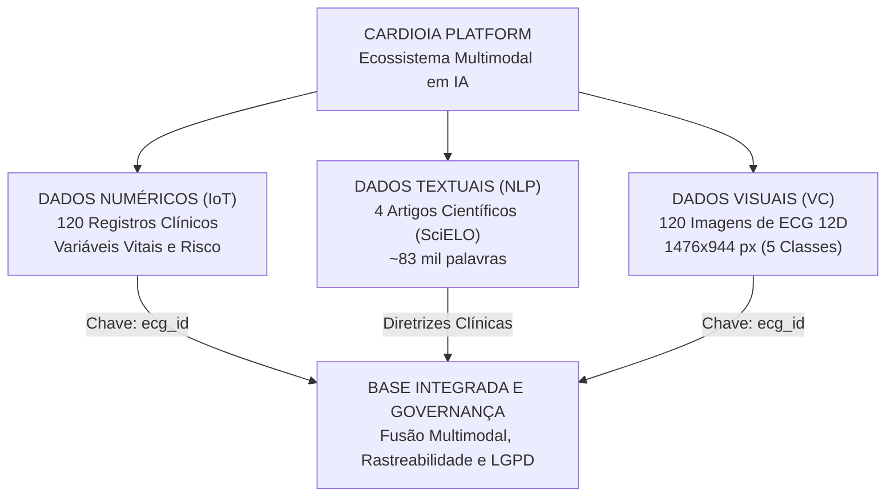

# Cap 1 - A Busca de Dados: Preparando o Terreno para a Inteligência Cardiológica

> **Plataforma Inteligente para o Ecossistema da Cardiologia Moderna**  
> **2TIAOR-2026 — FIAP**  
> **Fase 1: Batimentos de Dados**

---

## Integrantes do Grupo

| Nome | RM | Frente de Atuação | Repositório Original de Desenvolvimento |
|---|:---:|---|---|
| **João Rafael Gonçalves Ramos** | 567908 | Parte 1 — Dados Numéricos (IoT) | [`cardioia-dados-numericos`](https://github.com/joaorafa-ramos/cardioia-dados-numericos/tree/main) |
| **Leticia Guerra Soares** | 567501 | Parte 2 — Dados Textuais (NLP) | [`cardioia-dados-textuais`](https://github.com/leticiaguerrasoares/cardioia-dados-textuais/tree/main) |
| **Matheus Guimarães França** | 567144 | Consolidação, Governança & Integração | *(Este repositório consolidado de entrega)* |
| **Rivando Bezerra Cavalcanti Neto** | 568235 | Parte 3 — Dados Visuais (VC) | [`CardioIA`](https://github.com/RivandoNeto/CardioIA/tree/main) |

---

## 1. Visão Geral do Projeto CardioIA

O **CardioIA** é uma plataforma acadêmica interdisciplinar concebida para simular o ecossistema de uma cardiologia inteligente de ponta a ponta. O projeto visa integrar dados clínicos heterogêneos, modelos preditivos de Machine Learning, algoritmos de Processamento de Linguagem Natural (NLP), sistemas de Visão Computacional (VC) e fluxos de Internet das Coisas (IoT) para apoiar triagem, diagnóstico assistido, monitoramento contínuo e tomada de decisão clínica.

Na **Fase 1 — Batimentos de Dados**, assumimos o papel de cientistas de dados hospitalares para construir a infraestrutura fundacional de dados do projeto, assegurando rigor metodológico, proveniência rastreável, governança responsável e mitigação ativa de vieses algorítmicos.



---

## 2. Acesso Rápido aos Dados e Entregáveis

Todos os conjuntos de dados estão organizados nas subpastas deste repositório e podem ser acessados diretamente pelos links abaixo:

| Modalidade | Entregável Principal | Formato / Volume | Link Direto no Repositório |
|---|---|:---:|---|
| **Parte 1 — Numéricos (IoT)** | Dataset Clínico Tabular | CSV (120 linhas, 10 colunas) | [`data/cardioia_dataset_numerico.csv`](data/cardioia_dataset_numerico.csv) |
| **Parte 1 — Numéricos (IoT)** | Dicionário de Dados | Markdown | [`docs/dicionario_dados.md`](docs/dicionario_dados.md) |
| **Parte 2 — Textuais (NLP)** | Corpus de Textos Médicos | 4 arquivos `.txt` (~83k palavras) | [`docs/`](docs/) |
| **Parte 2 — Textuais (NLP)** | Catálogo de Proveniência | CSV | [`docs/fontes.csv`](docs/fontes.csv) |
| **Parte 3 — Visuais (VC)** | Imagens de ECG (12 derivações) | 120 imagens `.jpg` (1476×944 px) | [`data/ecg_images/`](data/ecg_images/) |
| **Parte 3 — Visuais (VC)** | Catálogo e Manifesto de ECG | CSV | [`data/ecg_images/manifest.csv`](data/ecg_images/manifest.csv) |

---

## 3. Parte 1 — Dados Numéricos (IoT)

> 🔗 **Repositório Individual de Origem (Parte 1):**  
> Para consultar a metodologia original de simulação determinística, cadernos e discussões adicionais desenvolvidas por **João Rafael Gonçalves Ramos**, acesse: [`joaorafa-ramos/cardioia-dados-numericos`](https://github.com/joaorafa-ramos/cardioia-dados-numericos/tree/main).

### 3.1. Descrição e Quantitativo
A base numérica é composta por **120 registros clínicos** de pacientes cardiológicos, estruturados em **10 variáveis padronizadas** que combinam dados demográficos, biomarcadores pressóricos, metabólicos, sintomáticos e diagnósticos.

- **Arquivo:** [`data/cardioia_dataset_numerico.csv`](data/cardioia_dataset_numerico.csv)
- **Documentação de apoio:** [`docs/dicionario_dados.md`](docs/dicionario_dados.md)
- **Metadados primários:** [`data/source/manifest_ecg_ptbxl.csv`](data/source/manifest_ecg_ptbxl.csv)

### 3.2. Origem dos Dados (Base Híbrida)
A base foi construída sob uma estratégia **híbrida e reprodutível**, visando garantir integração perfeita com as imagens da Parte 3:
1. **Metadados Reais:** Os atributos de identificação (`ecg_id`), idade (`idade_anos`), sexo biológico (`sexo`) e diagnóstico eletrocardiográfico padrão-ouro (`classe_ecg`) são registros reais extraídos do conceituado banco clínico **PTB-XL v1.0.3 (PhysioNet)**.
2. **Variáveis Clínicas Simuladas (Determinísticas):** Parâmetros hemodinâmicos e laboratoriais que não constavam no manifesto primário (pressão arterial sistólica e diastólica, colesterol total, glicemia de jejum, histórico cardiovascular prévio, sintomas e frequência cardíaca) foram gerados por simulação estocástica biologicamente parametrizada, com semente aleatória fixa (`seed = 42`), garantindo consistência fisiológica (ex.: correlação entre idade e hipertensão, níveis elevados de colesterol em pacientes com infarto prévio).

### 3.3. Dicionário de Variáveis

| Variável | Tipo | Unidade / Domínio | Descrição Clínica |
|---|:---:|:---:|---|
| `ecg_id` | Inteiro | Chave primária | Identificador único do paciente no PTB-XL; chave de ligação com a Parte 3. |
| `idade_anos` | Inteiro | Anos (18 a 89) | Idade cronológica do paciente no momento da avaliação. |
| `sexo` | Categoria | `F`, `M` | Sexo biológico registrado na admissão. |
| `pressao_arterial_mmhg` | Texto | `PAS/PAD` (mmHg) | Pressão Arterial Sistólica e Diastólica (ex.: `120/80`). |
| `colesterol_total_mg_dl` | Inteiro | mg/dL | Nível sérico de colesterol total (valor de referência: < 190 mg/dL). |
| `historico_doenca_cardiaca` | Binário | `0` (Não), `1` (Sim) | Histórico pregresso de infarto, insuficiência cardíaca ou angina. |
| `sintomas` | Categoria | Texto semiestruturado | Queixas clínicas relatadas (`Dor no peito`, `Dispneia`, `Palpitacoes`, `Sincope`, `Nenhum`). |
| `frequencia_cardiaca_bpm` | Inteiro | batimentos/min | Frequência cardíaca instantânea (relação com sensores de IoT). |
| `classe_ecg` | Categoria | 5 superclasses | Diagnóstico do ECG: `NORM` (Normal), `MI` (Infarto), `STTC` (Alt. ST/T), `CD` (Dist. Condução), `HYP` (Hipertrofia). |
| `glicemia_jejum_mg_dl` | Inteiro | mg/dL | Glicemia plasmática de jejum (indicador metabólico de risco e diabetes). |

### 3.4. Justificativa Clínica das Variáveis Selecionadas
- **Pressão Arterial:** A hipertensão é a principal causa modificável de morbimortalidade cardiovascular no mundo, sobrecarregando a pós-carga ventricular e acelerando a aterosclerose.
- **Colesterol Total e Glicemia:** Biomarcadores metabólicos fundamentais para o cálculo do escore de risco cardiovascular global (como o escore de Framingham) e avaliação de síndrome metabólica.
- **Frequência Cardíaca (IoT):** Sinal vital de monitoramento contínuo por excelência. Em ecossistemas de telemedicina e vestíveis inteligentes (*wearables* / smartwatches), alterações abruptas na FC (taquicardias, bradicardias ou variabilidade RR) são gatilhos críticos de alerta precoce.
- **Sintomas e Histórico Clínico:** Permitem contextualizar os dados brutos e diferenciar alterações fisiológicas (ex.: atleta jovem com bradicardia assintomática) de emergências agudas (ex.: idoso hipertenso com dor precordial e dispneia).
- **Classe do ECG (`classe_ecg`):** Fornece o rótulo diagnóstico objetivo para treinamento supervisionado e validação cruzada entre dados tabulares e visuais.

### 3.5. Aplicações em Inteligência Artificial
- Modelagem preditiva tabular para estratificação de risco (regressão logística, *Gradient Boosting* / XGBoost / LightGBM).
- Detecção não supervisionada de anomalias hemodinâmicas em fluxos de telemetria IoT.
- Fusão multimodal tabular-imagem (arquiteturas multimodais que concatenam os vetores de características clínicas com embeddings de visão gerados a partir do ECG).

---

## 4. Parte 2 — Dados Textuais (NLP)

> 🔗 **Repositório Individual de Origem (Parte 2):**  
> Para consultar a discussão aprofundada de NLP, catalogação das fontes e notas metodológicas desenvolvidas por **Leticia Guerra Soares**, acesse: [`leticiaguerrasoares/cardioia-dados-textuais`](https://github.com/leticiaguerrasoares/cardioia-dados-textuais/tree/main).

### 4.1. Descrição e Corpus Textual
O corpus textual é formado por **4 publicações científicas completas em língua portuguesa**, obtidas diretamente da **SciELO (Scientific Electronic Library Online)**, totalizando **83.491 palavras** e abrangendo diferentes tipologias textuais (revisão de literatura, diretriz clínica institucional, artigo de atualização e artigo de opinião/saúde coletiva).

- **Diretório dos textos:** [`docs/`](docs/)
- **Catálogo de metadados:** [`docs/fontes.csv`](docs/fontes.csv)
- **Script de exploração:** [`scripts/explorar_textos.py`](scripts/explorar_textos.py)

### 4.2. Catálogo de Fontes e Proveniência

| # | Arquivo | Título / Autores | Ano | Palavras | Vocabulário | Periódico / Fonte | Licença |
|:---:|---|---|:---:|:---:|:---:|---|:---:|
| **01** | [`texto_01_pinho_pierin_controle_hipertensao_2013.txt`](docs/texto_01_pinho_pierin_controle_hipertensao_2013.txt) | *O controle da hipertensão arterial em publicações brasileiras* (Pinho & Pierin) | 2013 | 2.771 | 1.171 | Arq. Bras. Cardiol. | CC BY-NC 4.0 |
| **02** | [`texto_02_diretriz_infarto_agudo_miocardio_2004.txt`](docs/texto_02_diretriz_infarto_agudo_miocardio_2004.txt) | *III Diretriz sobre Tratamento do Infarto Agudo do Miocárdio* (Sociedade Brasileira de Cardiologia) | 2004 | 77.068 | 7.973 | Arq. Bras. Cardiol. | CC BY-NC 4.0 |
| **03** | [`texto_03_insuficiencia_cardiaca_1998.txt`](docs/texto_03_insuficiencia_cardiaca_1998.txt) | *Insuficiência Cardíaca* (Barretto & Ramires) | 1998 | 2.420 | 1.050 | Arq. Bras. Cardiol. | CC BY-NC 4.0 |
| **04** | [`texto_04_prevencao_doencas_cardiovasculares_2012.txt`](docs/texto_04_prevencao_doencas_cardiovasculares_2012.txt) | *Prevenção de doenças cardiovasculares e promoção da saúde* (Achutti) | 2012 | 1.232 | 609 | Ciênc. Saúde Coletiva | CC BY-NC 4.0 |

> **Nota de Conformidade:** O enunciado solicita um mínimo de 2 textos. Foram selecionados 4 textos completos para conferir amplitude analítica, riqueza léxica e viabilizar tanto tarefas de processamento de documentos curtos quanto de mineração de textos extensos.

### 4.3. Exploração por Algoritmos de NLP
1. **Classificação de Tópicos e Documentos:** Treinamento de modelos para categorizar automaticamente o assunto de prontuários, laudos e artigos (ex.: TF-IDF + Naive Bayes/SVM, e fine-tuning de modelos transformadores em português como o **BERTimbau** / ClinicalBERT).
2. **Reconhecimento de Entidades Nomeadas (NER) e Extração de Sintomas:** Extração automatizada de sintomatologias (dor torácica, dispneia, palpitações, edema), classes de fármacos (betabloqueadores, estatinas, IECA), procedimentos (angioplastia, trombólise) e dosagens a partir de texto clínico livre.
3. **Análise de Sentimento, Percepção e Adesão Terapêutica:** Processamento de narrativas de pacientes para identificar barreiras à adesão medicamentosa, fatores socioeconômicos e sinais de descontinuidade de tratamento no SUS.
4. **Sistemas de Pergunta-Resposta (Question Answering) e RAG (*Retrieval-Augmented Generation*):** Indexação vetorial dos trechos de diretrizes clínicas para alimentar assistentes conversacionais que respondem dúvidas médicas com base estrita em evidências validadas pela SBC.

### 4.4. Importância para a Inteligência Artificial em Saúde
Estima-se que mais de 80% das informações em sistemas hospitalares estejam em formato não estruturado (evoluções de enfermagem, anotações de prontuário, relatórios de alta). O processamento de linguagem natural permite estruturar esse oceano de texto, acelerar a triagem de casos graves e mitigar falhas humanas no acompanhamento de doentes crônicos.

---

## 5. Parte 3 — Dados Visuais (Visão Computacional)

> 🔗 **Repositório Individual de Origem (Parte 3):**  
> Para consultar a documentação técnica da renderização a partir do sinal WFDB, pipeline reprodutível e discussões detalhadas de Visão Computacional desenvolvidas por **Rivando Bezerra Cavalcanti Neto**, acesse: [`RivandoNeto/CardioIA`](https://github.com/RivandoNeto/CardioIA/tree/main).

### 5.1. Descrição e Características Técnicas
O conjunto visual é composto por **120 imagens de Eletrocardiograma de 12 Derivações (ECG)** de alta resolução, padronizadas segundo as normas de impressão cardiológica internacional.

- **Diretório das imagens:** [`data/ecg_images/`](data/ecg_images/)
- **Manifesto completo de auditoria:** [`data/ecg_images/manifest.csv`](data/ecg_images/manifest.csv)
- **Script gerador e reprodutível:** [`scripts/gerar_ecg_imagens.py`](scripts/gerar_ecg_imagens.py)

| Parâmetro Técnico | Especificação |
|---|---|
| **Tipo de Exame** | ECG de repouso, 12 derivações simultâneas, duração de 10 segundos |
| **Resolução e Dimensões** | 1476 × 944 pixels, RGB, formato JPEG (~500 KB por arquivo) |
| **Escala Física do Papel** | Velocidade: 25 mm/s | Calibração de voltagem: 10 mm/mV (1 mm = 0,04 s / 0,1 mV) |
| **Layout Gráfico** | Formato clássico 3×4 (I, II, III; aVR, aVL, aVF; V1, V2, V3; V4, V5, V6) + Tira de ritmo contínua (derivação DII) |
| **Fonte Primária** | Banco aberto de sinais brutos **PTB-XL v1.0.3 (PhysioNet)** |
| **Licença dos Dados** | Creative Commons Attribution 4.0 International (CC BY 4.0) |

### 5.2. Composição Amostral Rigorosamente Balanceada
Para mitigar atalhos de aprendizado estatístico (*spurious correlations*), a base foi amostrada de forma perfeitamente equilibrada entre as **5 superclasses diagnósticas** do PTB-XL e com **paridade estrita de sexo** (50% feminino / 50% masculino em cada classe):

| Superclasse | Significado Clínico | Feminino | Masculino | Total de Imagens |
|:---:|---|:---:|:---:|:---:|
| `NORM` | Eletrocardiograma Normal (Controle) | 12 | 12 | **24** |
| `MI` | Infarto do Miocárdio (*Myocardial Infarction*) | 12 | 12 | **24** |
| `STTC` | Alterações de Segmento ST e Onda T | 12 | 12 | **24** |
| `CD` | Distúrbios de Condução / Bloqueios Intraventriculares | 12 | 12 | **24** |
| `HYP` | Hipertrofia Ventricular / Sobrecarga | 12 | 12 | **24** |
| **Total Geral** | | **60** | **60** | **120** |

### 5.3. Análise por Algoritmos de Visão Computacional
1. **Pré-processamento e Detecção de Bordas (Digitalização de ECG):**
   - No espaço de cores RGB/HSV, o traçado eletrocardiográfico (preto) e a grade milimetrada (vermelha) ocupam canais distintos. Operadores morfológicos e detectores de borda (Sobel, Canny) combinados com binarização de Otsu permitem eliminar o papel milimetrado e isolar a curva vetorial do sinal elétrico para digitalização de acervos físicos históricos.
2. **Segmentação e Detecção de Objetos (Bounding Boxes Morfológicas):**
   - Segmentação automática das 12 janelas de derivação por histograma de projeção.
   - Aplicação de detectores modernos (YOLOv8, Faster R-CNN) para localizar componentes da onda cardíaca: **complexo QRS**, onda P e onda T. A partir das coordenadas dos *bounding boxes* e da escala física (25 mm/s), o algoritmo calcula automaticamente a frequência cardíaca, o intervalo PR, a largura do QRS e o intervalo QT corrigido (QTc).
3. **Reconhecimento de Padrões, Anomalias e Classificação:**
   - Classificação diagnóstica multiclasse utilizando Redes Neurais Convolucionais (*ResNet-50*, *EfficientNet-B4*) e *Vision Transformers* (*ViT*).
   - Detecção de anomalias não supervisionada através de *Autoencoders* treinados exclusivamente sobre traçados normais (`NORM`), identificando qualquer cardiopatia aguda como alto erro de reconstrução na imagem.
4. **Explicabilidade Visual (Grad-CAM):**
   - Aplicação de *Gradient-weighted Class Activation Mapping* (Grad-CAM) para gerar mapas de calor sobre o traçado, validando se o modelo tomou a decisão clínica com base na morfologia correta (ex.: supradesnivelamento de ST no infarto) e não em ruídos de fundo.

### 5.4. Importância para a Saúde Pública e Telemedicina
Em grande parte das unidades básicas e hospitais do interior do Brasil, exames de ECG são impressos em papel térmico ou arquivados como fotos tiradas por equipes de enfermagem. Algoritmos capazes de interpretar a **imagem** do ECG viabilizam a triagem inteligente à distância, priorizando instantaneamente exames com sinais de infarto agudo no topo da fila dos centros de telecardiologia.

---

## 6. Governança de Dados, Ética e Análise Crítica de Vieses

### 6.1. Privacidade e Conformidade com a LGPD
- **Desidentificação Completa na Origem:** O PTB-XL é um repositório público anonimizado que omite qualquer dado de identificação pessoal (nomes, documentos, endereços ou número de prontuário). Idades superiores a 89 anos são agregadas para proteção contra reidentificação.
- **Tratamento de Dados de Saúde:** Nenhuma informação privada ou sensível de pacientes identificáveis nos termos dos artigos 5º (II) e 11 da LGPD (Lei 13.709/2018) é processada neste repositório.

### 6.2. Licenciamento e Direitos Autorais
- **Dados Numéricos e Imagens:** Licença **Creative Commons Attribution 4.0 International (CC BY 4.0)**, permitindo uso acadêmico, adaptação e redistribuição mediante citação do *PhysioNet / PTB-XL*.
- **Textos Científicos:** Licença **Creative Commons Attribution-NonCommercial 4.0 International (CC BY-NC 4.0)** da SciELO, garantindo livre uso para ensino e pesquisa sem finalidade comercial.

### 6.3. Prevenção de Vazamento de Rótulo (*Label Leakage*)
- **Imagens:** O diagnóstico **não** é impresso na imagem do exame; o traçado contém apenas as curvas de voltagem e o identificador numérico `ecg_id`. O rótulo diagnóstico reside exclusivamente no manifesto (`manifest.csv`), impedindo que redes convolucionais aprendam a "ler a legenda" em vez do padrão eletrocardiográfico.
- **Textos:** O script de exploração remove cabeçalhos de metadados antes de contabilizar frequências e termos clínicos, evitando enviesamento das métricas.

### 6.4. Vieses Mitigados e Vieses Declarados

| Vieses Mitigados | Vieses Declarados |
|---|---|
| Paridade de Sexo (50% F / 50% M por classe) | Correlação Idade/Doença (Idade elevada em `MI`) |
| Balanceamento de Classes (24 exames por superclasse) | Demografia Eurocêntrica (Alemanha, 1987–2000) |
| Validação Humana dos Laudos (`validated_by_human`) | Sinal Limpo vs. Foto Real de Papel Amassado |
| Exclusão de Marcapassos (Remoção de artefatos espúrios) | Variabilidade de Modelos de Eletrocardiógrafo |

- **Vieses Mitigados:**
  1. *Sub-representação de gênero:* Em dados cardiológicos reais, homens costumam ser maioria em infarto agudo. Forçamos uma distribuição exatamente 50/50 em todas as 5 classes para que o modelo não associe infarto exclusivamente a padrões masculinos.
  2. *Desbalanceamento de classes:* Equalizamos 24 amostras por classe diagnóstica.
  3. *Ambiguidade diagnóstica:* Foram selecionados apenas registros com laudo confirmado por cardiologista (`validated_by_human = True`) e com classe patológica única.
  4. *Artefatos de hardware:* Pacientes com marcapasso foram excluídos da amostra para evitar que a espícula do dispositivo funcionasse como pista espúria.
- **Vieses Declarados (Limitações do Estudo):**
  1. *Viés etário:* Pacientes da classe `MI` possuem mediana de idade superior (75,5 anos) aos de `NORM` (53 anos). Essa correlação reflete a epidemiologia natural, mas exige validação futura estratificada por faixa etária.
  2. *População de Referência:* Os exames do PTB-XL foram coletados na Alemanha entre 1987 e 2000, não capturando a miscigenação étnica brasileira.
  3. *Condições de Aquisição:* Os ECGs atuais foram renderizados a partir de sinal digital limpo; em fases futuras, será necessário introduzir aumento de dados (*data augmentation*) com rotações, sombras e ruídos para simular fotos de celular em papel amassado.

---

## 7. Estrutura de Diretórios do Repositório

```text
entregavel/
├── README.md                      # Documentação mestre consolidada do projeto
├── requirements.txt               # Dependências de bibliotecas Python
├── .gitignore                     # Configuração de arquivos ignorados no controle de versão
├── data/
│   ├── cardioia_dataset_numerico.csv  # Base clínica tabular (Parte 1 - 120 registros)
│   ├── ecg_images/                # Acervo visual de ECGs (Parte 3 - 120 imagens + manifesto)
│   │   ├── manifest.csv
│   │   ├── CD_*.jpg (24 exames)
│   │   ├── HYP_*.jpg (24 exames)
│   │   ├── MI_*.jpg (24 exames)
│   │   ├── NORM_*.jpg (24 exames)
│   │   └── STTC_*.jpg (24 exames)
│   └── source/                    # Metadados de ligação primária
│       └── manifest_ecg_ptbxl.csv
├── docs/
│   ├── dicionario_dados.md        # Dicionário de dados da base tabular
│   ├── fontes.csv                 # Catálogo de proveniência dos textos SciELO
│   ├── texto_01_pinho_pierin_controle_hipertensao_2013.txt
│   ├── texto_02_diretriz_infarto_agudo_miocardio_2004.txt
│   ├── texto_03_insuficiencia_cardiaca_1998.txt
│   └── texto_04_prevencao_doencas_cardiovasculares_2012.txt
└── scripts/
    ├── gerar_dataset.mjs          # Script Node.js de geração determinística da base numérica
    ├── explorar_textos.py         # Script Python de análise exploratória léxica e clínica (NLP)
    └── gerar_ecg_imagens.py       # Pipeline Python de download e renderização dos ECGs (VC)
```

---

## 8. Guia de Reprodutibilidade e Execução

### 8.1. Pré-requisitos
- **Python 3.10+**
- **Node.js 18+** (para o gerador de dados numéricos)

### 8.2. Configuração do Ambiente Virtual Python
```bash
# 1. Criação do ambiente virtual
python -m venv .venv

# 2. Ativação do ambiente (Linux/macOS)
source .venv/bin/activate
# No Windows (PowerShell):
# .venv\Scripts\Activate.ps1

# 3. Instalação das dependências
pip install -r requirements.txt
```

### 8.3. Execução dos Scripts do Projeto

#### A. Análise Exploratória dos Textos Médicos (NLP)
O script utiliza apenas a biblioteca padrão do Python e analisa o volume de palavras, vocabulário único e termos clínicos frequentes:
```bash
python scripts/explorar_textos.py
```

#### B. Regeneração Determinística do Dataset Numérico (IoT)
Com o Node.js instalado, o script recria a base numérica a partir do manifesto com a mesma semente (`seed = 42`):
```bash
node scripts/gerar_dataset.mjs
```

#### C. Renderização e Download das Imagens de ECG (VC)
Caso deseje reproduzir todo o download do PhysioNet e a renderização gráfica dos 120 exames em papel milimetrado:
```bash
python scripts/gerar_ecg_imagens.py --por-classe 24
```

---

## 9. Referências Bibliográficas e Fontes

1. **PTB-XL Dataset:** Wagner, P. et al. *PTB-XL, a large publicly available electrocardiography dataset*. Scientific Data 7, 154 (2020). DOI: [10.1038/s41597-020-0495-6](https://doi.org/10.1038/s41597-020-0495-6).
2. **PhysioNet:** Goldberger, A. L. et al. *PhysioBank, PhysioToolkit, and PhysioNet: Components of a New Research Resource for Complex Physiologic Signals*. Circulation 101(23): e215–e220 (2000).
3. **Hipertensão:** Pinho, N. A.; Pierin, A. M. G. *O controle da hipertensão arterial em publicações brasileiras*. Arquivos Brasileiros de Cardiologia, v. 101, n. 3, p. e65-e73, 2013.
4. **Infarto Agudo do Miocárdio:** Sociedade Brasileira de Cardiologia. *III Diretriz sobre Tratamento do Infarto Agudo do Miocárdio*. Arquivos Brasileiros de Cardiologia, v. 83, supl. 4, p. 1-86, 2004.
5. **Insuficiência Cardíaca:** Barretto, A. C. P.; Ramires, J. A. F. *Insuficiência Cardíaca*. Arquivos Brasileiros de Cardiologia, v. 71, n. 4, p. 635-642, 1998.
6. **Prevenção Cardiovascular:** Achutti, A. *Prevenção de doenças cardiovasculares e promoção da saúde*. Ciência & Saúde Coletiva, v. 17, n. 12, p. 3174-3176, 2012.
